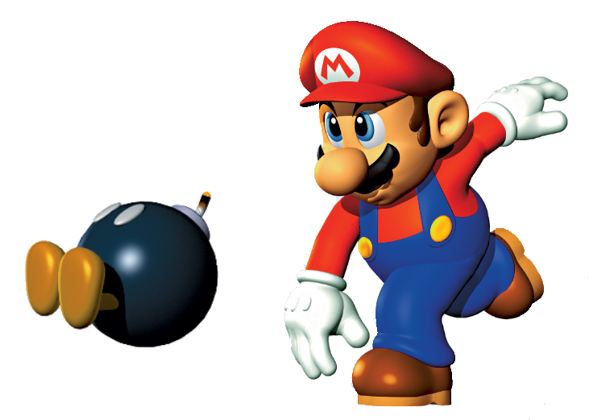

# **BomberMario: Reinforcement Learning for Game AI**

**Authors:** Daniel Richter, Rhea Habermann, Julian Aßmann  

**Institution:** Karls-Ruprecht-Universität Heidelberg

**Year:** 2022  

**Grade:** 1.3 (German Grading Scale)  

---

  

---
## 📖 **Overview**
This repository contains the final project for the **Fundamentals of Machine Learning** course, where we developed **reinforcement learning models** to master the game **Bomberman**. The main objective was to design and implement:
- A **Q-table agent**.
- A **Deep Q-Learning Network (DQN)** agent with a convolutional neural network (CNN) architecture.

The project emphasizes the practical application of reinforcement learning in a **grid-based strategic environment**.

---

## **Results**

## 🛠 **Technologies Used**
- **Reinforcement Learning Frameworks:** TensorFlow, Keras
- **Programming Language:** Python
- **Game Development Tools:** OpenAI Gym, Custom Bomberman Simulator
- **Visualization Libraries:** Matplotlib, Seaborn

---

## 📊 **Evaluation Metrics**
- **Total Reward**: Evaluated based on coins collected, opponents eliminated, and game survival.
- **Episode Length**: Measured to observe learning efficiency and stability.

---

## 📄 **Project Highlights**
- **Q-Learning Implementation**: Built a Q-table-based agent to navigate the grid and collect coins efficiently.
- **Deep Q-Learning Network (DQN)**: Designed a CNN architecture to handle complex scenarios involving multiple agents, bomb placements, and strategic movements.
- **Advanced Features**:
  - Agent-centered field of view.
  - Temporal fields to predict bomb explosions.
  - Dynamic reward shaping for learning optimization.
- **Challenges Overcome**: Addressed issues like catastrophic forgetting, overfitting, and exploration-exploitation balance.

---

## 📩 **Contact & Reference**
For further details or collaboration opportunities, please reach out:
- [GitHub Repository](https://github.com/Ztec1337/bombermario)

---

For more details, check the full **project report** available in this repository or request access directly!

